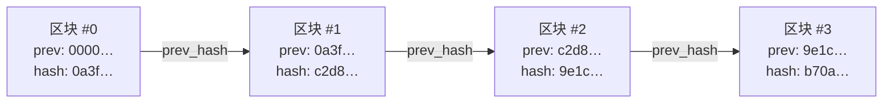
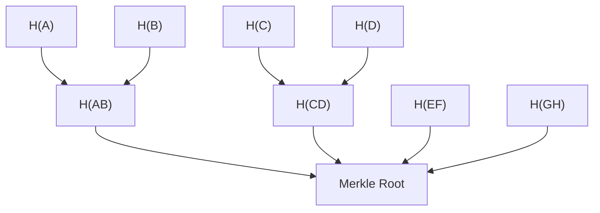
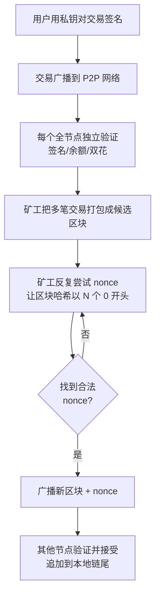
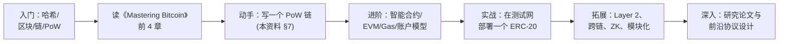

# 区块链 学习资料

> 学习资料 · 大数据与人工智能课程 · 区块链入门
>
> - **预计学习时长**：60–90 分钟（含代码实战）
> - **难度**：入门
> - **前置知识**：基础 Python、哈希概念、简单的密码学直觉
> - **关联课程方向**：分布式系统、数据可信性、AI 数据治理

---

## 0. 学习目标

学完这份资料，你应当能够：

1. 用一句话清晰定义"区块链是什么、解决什么问题"
2. 描述一个区块的内部结构，以及它如何与前后区块通过哈希指针串联成链
3. 解释工作量证明（PoW）与权益证明（PoS）的基本原理，并比较差异
4. 说出智能合约的作用以及以太坊的关键创新
5. 用一段 Python 代码实现一个能挖矿、能验链、能直观看到"改一处就断链"的最小区块链
6. 阐述区块链与大数据/AI 的交叉点（链上分析、AI 模型上链审计等）

---

## 1. 一句话定义

**区块链**是一种**去中心化的分布式账本**：它把一段时间内的交易打包成"区块"，再用密码学哈希把每个区块按时间顺序引用前一个区块的哈希，形成一条**只可追加、难以篡改**的链；账本的完整副本分布在网络中的多个节点上，不需要中心机构来记账或仲裁。

它要解决的核心问题是：**在没有可信第三方的情况下，让一群互不信任的节点对一份共享账本达成一致**——这就是所谓的"拜占庭将军问题"。

---

## 2. 历史与演进

| 时间 | 事件 | 关键意义 |
|------|------|---------|
| 2008 | 中本聪发表《Bitcoin: A Peer-to-Peer Electronic Cash System》 | 区块链概念的首个工程化蓝图 |
| 2009 | 比特币创世区块被挖出 | 第一个真正运行的区块链网络 |
| 2015 | 以太坊主网上线 | 引入图灵完备的智能合约 |
| 2017 | ICO 与 ERC-20 热潮 | 智能合约大规模落地 |
| 2020 | DeFi Summer、NFT 出圈 | 区块链走向应用层 |
| 2022 | 以太坊 Merge（PoW → PoS） | 共识机制重大转向，能耗下降 ~99% |
| 2023+ | Layer 2、跨链、模块化区块链 | 解决可扩展性瓶颈 |

---

## 3. 核心概念详解

### 3.1 区块（Block）

一个**区块**是链上的最小"账本页"，通常包含：

| 字段 | 含义 |
|------|------|
| `index / height` | 区块在链中的序号 |
| `timestamp` | 出块时间 |
| `transactions` | 一段时间内的交易列表 |
| `prev_hash` | 前一个区块的哈希（"指针"） |
| `nonce` | 工作量证明中找到的随机数 |
| `merkle_root` | 交易列表的哈希摘要根 |
| `hash` | 当前区块所有字段一起哈希得到的"指纹" |

> 关键直觉：`hash` 是区块的"指纹"；`prev_hash` 是区块的"父指针"。任何字段改动都会让 `hash` 完全不同。

### 3.2 哈希函数（Hash）

哈希函数把任意长度输入映射成**固定长度**输出，且满足：

- **确定性**：同样输入永远得到同样输出
- **抗碰撞性**：找不到两个不同输入产生相同输出
- **抗原像性**：无法从输出反推输入
- **雪崩效应**：输入改 1 比特，输出大概率一半比特都变

比特币和大多数区块链用 **SHA-256**（输出 256 位）。

```python
import hashlib
print(hashlib.sha256(b"hello").hexdigest())
# 2cf24dba5fb0a30e26e83b2ac5b9e29e1b161e5c1fa7425e73043362938b9824

print(hashlib.sha256(b"hello!").hexdigest())  # 改一个字节
# 截断后完全不同
```

### 3.3 链式结构（哈希指针）



**为什么不可篡改？**
- 想改 #1 的某个交易 → #1 的 `hash` 变 → #2 的 `prev_hash` 对不上 → #2 也得改 → …… → 要重算后面所有区块
- 在 PoW 链上重算所有区块需要超过全网 51% 的算力，代价极其高昂

### 3.4 分布式账本（Distributed Ledger）

- 节点：**全节点**保存完整链并独立验证；**轻节点**只保存区块头
- 同步：节点之间通过 gossip 协议互相同步新区块
- 容错：只要不超过 1/3（PBFT）或 1/2（PoW/PoS）的节点作恶，系统就能继续正确运行

### 3.5 共识机制（Consensus）

没有中心服务器，怎么让所有节点对"下一区块是什么"达成一致？答案就是共识机制（详见 §5）。

### 3.6 Merkle 树

把所有交易两两哈希、再哈希、直到得到一个根哈希——这个根就是 `merkle_root`。



**用处**：轻节点只要拿到一个 Merkle 证明，就能验证某笔交易是否被打包进了某个区块，而不必下载整条链。

### 3.7 公开密钥密码学

- 每个用户有一对密钥：**私钥**（保密，用于签名）和**公钥**（公开，即地址）
- 签名：用私钥对交易数据签名 → 任何人都能用公钥验证签名确实来自私钥持有者
- **关键**：私钥一旦丢失，账户资产永久不可恢复

---

## 4. 工作原理（以比特币为例）



补充说明：

- **双花问题**：同一笔钱被花两次。区块链通过"最长链 + UTXO 已花费记录"防双花。
- **出块间隔**：比特币目标 10 分钟，难度每 2016 个区块（约两周）根据实际出块速度自动调整。
- **奖励**：成功出块的矿工获得新铸造的代币 + 区块内所有交易手续费。

---

## 5. 主流共识机制对比

| 机制 | 全称 | 如何选举出块人 | 典型项目 | 优点 | 缺点 |
|------|------|---------------|---------|------|------|
| **PoW** | 工作量证明（Proof of Work） | 谁的算力先算出哈希就谁出块 | 比特币、莱特币、曾经的以太坊 | 最安全、抗审查 | 高耗能、TPS 低 |
| **PoS** | 权益证明（Proof of Stake） | 按质押代币数量与时长加权随机选 | 以太坊（合并后）、Cardano | 节能、终结性快 | "富者更富"、惩罚机制复杂 |
| **DPoS** | 委托权益证明 | 持币人投票选出 21 个超级节点 | EOS、BSC | 高 TPS | 中心化风险 |
| **PBFT** | 实用拜占庭容错 | 节点轮流提案 + 多轮投票 | 联盟链（Hyperledger） | 终结即确定 | 节点数受限（一般 < 50） |
| **PoH/PoSpace** | 空间/时间证明 | 用硬盘空间或顺序时间证明 | Chia、Solana | 降低能耗 | 历史短、验证者集中 |

> 一句话：PoW 用"电费"买信任，PoS 用"押金"买信任。

---

## 6. 智能合约与以太坊

### 6.1 智能合约

部署在链上、**按预设代码自动执行**的程序。给定输入和链上状态，输出确定，无需第三方。

### 6.2 以太坊的关键创新

- **EVM**（Ethereum Virtual Machine）：在每个全节点上运行的"全球一台计算机"
- **账户模型**：与比特币的 UTXO 不同，以太坊用账户（地址 + 余额 + 随机数 + 存储 + 代码）
- **Gas**：每步 EVM 指令都要付费（Gas），防止死循环与拒绝服务
- **Solidity**：写智能合约的主力语言

### 6.3 最简 Solidity 合约

```solidity
// SPDX-License-Identifier: MIT
pragma solidity ^0.8.0;

contract SimpleStorage {
    uint256 public storedData;

    function set(uint256 x) public {
        storedData = x;
    }

    function get() public view returns (uint256) {
        return storedData;
    }
}
```

部署后，任何人都可以调用 `set` 写入，调用 `get` 读取——全网见证，无法篡改。

---

## 7. 实战：Python 最小区块链（80 行）

下面这段代码实现一个能挖矿、能验链、改一处就让整条链失效的最小区块链。把它保存到 `code/blockchain_demo.py` 就能直接跑。

```python
"""
blockchain_demo.py — 最小可运行的区块链演示

演示要点：
1. 区块通过 SHA-256 哈希串联
2. 工作量证明（PoW）：找一个 nonce 让区块哈希以 difficulty 个 0 开头
3. 篡改任何区块会让 is_chain_valid() 返回 False
"""

import hashlib
import json
import time
from typing import List, Any


class Block:
    def __init__(self, index: int, transactions: List[Any],
                 prev_hash: str, difficulty: int = 4):
        self.index = index
        self.timestamp = time.time()
        self.transactions = transactions
        self.prev_hash = prev_hash
        self.difficulty = difficulty
        self.nonce = 0
        self.hash = self.compute_hash()

    def compute_hash(self) -> str:
        """把区块所有字段一起哈希，得到区块的'指纹'。"""
        block_data = {
            "index": self.index,
            "timestamp": self.timestamp,
            "transactions": self.transactions,
            "prev_hash": self.prev_hash,
            "nonce": self.nonce,
        }
        payload = json.dumps(block_data, sort_keys=True).encode()
        return hashlib.sha256(payload).hexdigest()

    def mine(self) -> None:
        """工作量证明：调整 nonce 直到 hash 以 difficulty 个 0 开头。"""
        target = "0" * self.difficulty
        started = time.time()
        while not self.hash.startswith(target):
            self.nonce += 1
            self.hash = self.compute_hash()
        print(f"  [mining] 挖矿成功 nonce={self.nonce} "
              f"用时{time.time()-started:.2f}s hash={self.hash[:16]}…")


class Blockchain:
    def __init__(self, difficulty: int = 4):
        self.chain: List[Block] = []
        self.difficulty = difficulty
        self._create_genesis_block()

    def _create_genesis_block(self) -> None:
        """创世区块：链的第一个区块，prev_hash 设为全 0。"""
        genesis = Block(0, ["Genesis Block"], "0" * 64, self.difficulty)
        self.chain.append(genesis)

    def add_block(self, transactions: List[Any]) -> Block:
        prev_block = self.chain[-1]
        new_block = Block(
            index=len(self.chain),
            transactions=transactions,
            prev_hash=prev_block.hash,
            difficulty=self.difficulty,
        )
        print(f"\n>> 添加区块 #{new_block.index}, "
              f"包含 {len(transactions)} 笔交易")
        new_block.mine()
        self.chain.append(new_block)
        return new_block

    def is_chain_valid(self) -> bool:
        """检查：①每个区块的 hash 是否还能算出来 ②prev_hash 是否对得上"""
        for i in range(1, len(self.chain)):
            curr = self.chain[i]
            prev = self.chain[i - 1]
            if curr.hash != curr.compute_hash():
                print(f"  [invalid] 区块 #{curr.index} 的哈希被篡改")
                return False
            if curr.prev_hash != prev.hash:
                print(f"  [invalid] 区块 #{curr.index} 的 prev_hash "
                      f"与前一个区块 hash 不一致")
                return False
        return True


def print_chain(chain: List[Block]) -> None:
    print("\n当前链：")
    for b in chain:
        print(f"  #{b.index} | hash={b.hash[:18]}… "
              f"| prev={b.prev_hash[:10]}…")


if __name__ == "__main__":
    # 1. 建链 + 挖两个区块
    bc = Blockchain(difficulty=4)
    bc.add_block(["Alice -> Bob: 10"])
    bc.add_block(["Bob  -> Carol: 5", "Carol -> Dave: 2"])

    print_chain(bc.chain)
    print(f"\n[check] 链有效？ {bc.is_chain_valid()}")

    # 2. 篡改测试：把第 1 块里的交易偷偷改了
    print("\n>> 黑客尝试篡改区块 #1 的交易...")
    bc.chain[1].transactions = ["Hacker -> Self: 99999"]
    print(f"[check] 篡改后链有效？ {bc.is_chain_valid()}")
    # 期望：False，因为我们没重新挖矿，哈希对不上
```

运行结果示例：

```
>> 添加区块 #1, 包含 1 笔交易
  [mining] 挖矿成功 nonce=43581 用时0.32s hash=0000a3f2bd91e8…
>> 添加区块 #2, 包含 2 笔交易
  [mining] 挖矿成功 nonce=21094 用时0.18s hash=0000c2d8447e3a…

当前链：
  #0 | hash=4f3c...              | prev=0000000000…
  #1 | hash=0000a3f2bd91e8…       | prev=4f3c...
  #2 | hash=0000c2d8447e3a…       | prev=0000a3f2bd91e8…

[check] 链有效？ True
>> 黑客尝试篡改区块 #1 的交易...
  [invalid] 区块 #1 的哈希被篡改
[check] 篡改后链有效？ False
```

这就是"改一处就让链断"的最直观证据。

---

## 8. 与大数据 / AI 课程的连接

### 8.1 链上数据是新的大数据源

每笔交易、每次合约调用都是结构化事件，可以用 Spark/Flink 做：

- **地址画像**：资金流向、持仓变化
- **市场分析**：DEX 交易量、Gas 价格走势
- **异常检测**：洗钱模式、钓鱼地址聚类

### 8.2 AI 应用场景

- **价格预测**：LSTM/Transformer 模型拟合加密资产价格序列
- **NFT 估值**：以图像特征 + 链上稀有度作为输入
- **合约安全**：用 NLP/图神经网络审计 Solidity 代码漏洞

### 8.3 数据可信性 + AI

痛点：训练数据被污染 / 模型被替换，谁来背书？

方案：
- 把训练数据集的 **Merkle Root** 写到链上 → 之后可以证明"这个数据确实来自这个数据集"
- 把模型权重哈希或版本号上链 → 可追溯哪个版本、何时部署

> 这也是"区块链 + AI"在企业级落地中最现实的方向之一：**让 AI 的关键决策可审计**。

---

## 9. 学习路径



**推荐资源**：

| 类型 | 名称 | 适合阶段 |
|------|------|---------|
| 书籍 | 《Mastering Bitcoin》（Andreas Antonopoulos） | 入门 |
| 书籍 | 《Mastering Ethereum》 | 进阶 |
| 文档 | [ethereum.org/developers](https://ethereum.org/developers/) | 实战 |
| 课程 | Bitcoin and Cryptocurrency Technologies（Princeton Coursera） | 入门 |
| 论文 | 中本聪《Bitcoin: A Peer-to-Peer Electronic Cash System》 | 入门/必读 |
| 论文 | Buterin 2014《Ethereum White Paper》 | 进阶 |
| 论文 | Buterin & Griffith 2017《Casper FFG》 | 深入 |

---

## 10. 自测题（不看答案先做一遍）

1. 为什么区块链说自己是"不可篡改"的？是不是绝对无法篡改？
2. SHA-256 输出几位？给出两个看起来相似的字符串，对比它们的 SHA-256 输出。
3. 一个区块改了 `transactions` 字段，为什么后续所有区块的哈希都得变？
4. PoW 和 PoS 各自解决了什么问题？分别牺牲了什么？
5. 如果矿工同时挖出两个区块，会发生什么？网络怎么收敛？
6. 私钥丢了，账户里的币还能找回吗？为什么？
7. 智能合约为什么需要 Gas？
8. 用一句话解释 Merkle 树的价值（为什么不全用哈希链表）。

<details>
<summary>提示 / 简要答案（点击展开）</summary>

1. 不是绝对。在拥有全网 > 50% 算力（PoW）或 > 50% 质押（PoS）时理论上可重写历史。代价巨大，所以"经济上不可行"。
2. 256 位 16 进制 = 64 个字符。给两个相似字符串分别哈希，会得到截然不同的两串。
3. 因为每个区块的 hash 是包含自身所有字段算出来的，`transactions` 变了 → 当前块的 hash 变 → 下一个块的 `prev_hash` 对不上 → 所有下游区块都得重算。
4. PoW 用能耗换安全；PoS 用押金换安全。PoW 高耗电但简单稳健；PoS 节能但要解决"nothing at stake"和惩罚机制。
5. 网络短暂分叉，最长链（或累计工作量/质押权重最大的链）胜出，短的被丢弃（孤块）。
6. 不能。私钥是资产的唯一控制凭证，丢了等于永久遗失。
7. 每步 EVM 指令消耗 Gas，攻击者无法用死循环永久占用节点资源。
8. Merkle 树让轻节点可以在只下载 O(log n) 数据的情况下证明某笔交易在区块中，而哈希链表需要 O(n)。

</details>

---

## 11. 一页速记卡（最后看一眼）

```
区块链 = 分布式账本 + 哈希链 + 共识机制

关键不变量：hash_n 包含 hash_{n-1} → 任何上游改动立刻让下游失效
核心目标：让互不信任的节点对账本状态达成一致
工程取舍：PoW 烧电换安全 / PoS 押钱换安全 / PBFT 节点少换确定性

智能合约 = 链上不可篡改的"if-then"程序
链上数据 = 新的大数据源
区块链 + AI = 可审计的数据/模型指纹
```

---

> 提示：这份资料配合 `notes/blockchain-intro.md`（短笔记） + `code/blockchain_demo.py`（可运行代码）一起使用效果最佳。
